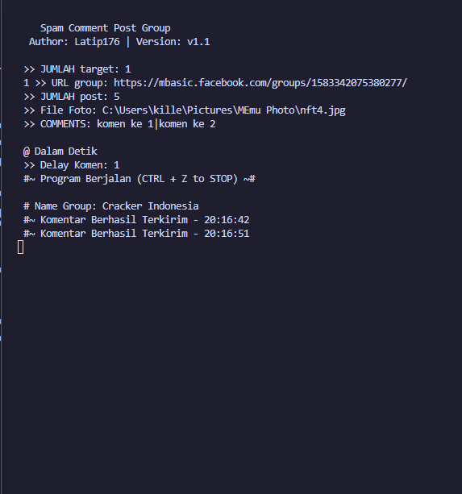

<h2 align="center">Comment Bot for Facebook Groups</h2>

This repository contains the source code for a comment bot designed to interact with Facebook groups. The bot automates the process of commenting on posts within specified groups, facilitating engagement and interaction within the community.

<h3>Features</h3>
<ul>
    <li>
        Automated Commenting: The bot is capable of automatically posting comments based on predefined criteria or triggers.
    </li>
    <li>
        Customizable Settings: Users can configure various parameters such as comment frequency, content, and targeting specific groups.
    </li>
</ul>

<h3>How Install?</h3>
<h4>Clone Repo</h4>
<pre>
git clone https://github.com/Latip176/comment-bot-group-facebook
</pre>
<h4>Install Requirements</h4>
<pre>
python3 -m pip install -r requirements.txt
</pre>

<h3>Run Script</h3>
<pre>
python run.py
</pre>
